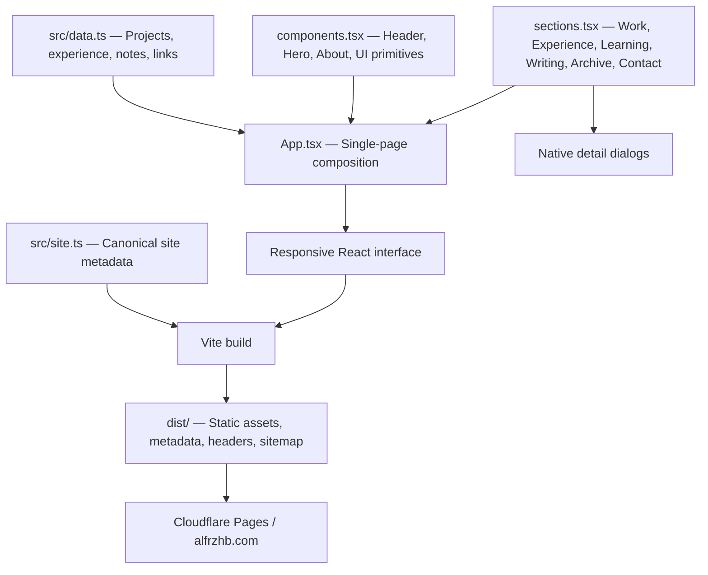

# ALFRZHB — Personal Portfolio

**A hand-drawn, editorial portfolio for Muhammad Alfarizi Habibullah, Software Engineer and Informatics graduate.**

[**Explore alfrzhb.com ↗**](https://alfrzhb.com) · [GitHub profile](https://github.com/alfrzhb)

This repository contains the source code for **alfrzhb.com**, my personal website: a curated collection of software projects, experience, learning, and technical writing. It pairs a clean, responsive interface with a recognizable **crayon / paper-like visual identity** and original ALFRZHB character artwork.

Unlike my previous pixel/voxel-inspired portfolio ([`portfolio-v1`](https://github.com/alfrzhb/portfolio-v1)), this version prioritizes **clarity, project storytelling, accessibility, and maintainability** over visual effects.

**Live domain:** [https://alfrzhb.com](https://alfrzhb.com)  
**Hosting:** Cloudflare Pages · **Application:** React 19 + TypeScript + Vite 7

## What you'll find

The website is **one continuous responsive page**, with in-page navigation and native detail dialogs rather than separate case-study/article routes.

| Section | Purpose |
| --- | --- |
| **Hero & About** | Introduction, engineering interests, and original hand-drawn character illustrations |
| **Selected Work** | Three featured projects with descriptions, technology tags, and expandable case studies |
| **Experience** | Internship and organization experience in a compact timeline |
| **Learning** | Education, learning programs, and credential status |
| **Writing** | Learning notes, clearly marked as **drafts awaiting personal review** |
| **Archive** | Additional applications, experiments, and earlier work |
| **Contact** | Email, GitHub, and LinkedIn links |

### Featured projects

1. **DDL Optimization + Generative AI** — undergraduate thesis exploring AI-assisted review, SQL suggestions, and validation of database DDL. [Repository](https://github.com/alfrzhb/tugas-akhir).
2. **Ratama Project & Finance Tracker** — an internal project/business tracking system with Cloudflare Pages, Workers, and D1.
3. **ACM Monitoring System** — an internal monitoring application developed during an internship at 295 Technology Solution.

The archive also includes Harumnesia, CRM, QRGen, UsStuck, MyDicodingEvent, and KKN Goat. Each entry is represented through curated content; private employer work is not published as source code through this portfolio.

**Case studies and writing:** Clicking a card opens a native `<dialog>`. There are currently no standalone `/projects/:slug` or `/writing/:slug` routes. Draft writing content is explicitly labelled as such.

## Design direction

The design language is deliberately restrained:

- **Editorial composition:** generous spacing, readable content hierarchy, and a mobile-first layout.
- **Hand-drawn identity:** crayon strokes, doodles, imperfect outlines, and the original full-body/head ALFRZHB illustrations.
- **Paper-inspired palette:** warm off-white, charcoal, slate-blue typography, and soft peach/green/lavender accents.
- **Typography:** self-hosted **DM Sans** for body text and **Kalam** for handwritten emphasis.
- **Real artwork, not fabricated screenshots:** the original character assets are preserved in [`assets/masters/`](assets/masters/). Project previews are illustrative UI compositions rather than screenshots of deployed products.

The original illustrations are not AI-regenerated or redrawn by this codebase. The hero uses the source full-body image; the About portrait uses an optimized derivative.

See [`docs/design-spec.md`](docs/design-spec.md) for the implementation specification.

## Tech stack

| Area | Implementation |
| --- | --- |
| UI | React 19, TypeScript, semantic HTML |
| Tooling | Vite 7, npm, TypeScript 5.9, ESLint 10 |
| Styling | Custom responsive CSS with design tokens, CSS Grid/Flexbox |
| Icons | Lucide React |
| Fonts | Locally bundled DM Sans and Kalam |
| Content | Typed data objects in `src/data.ts` |
| Hosting | Cloudflare Pages, static `dist/` build |
| CI | GitHub Actions: install, lint, typecheck, build (Node 22) |

No CMS, server-side API, database, Cloudflare Worker, D1 binding, or runtime secret is required for the portfolio.

### Page composition



Content and presentation are intentionally separated: project details, notes, education, experience, and social destinations are edited in one data module rather than scattered throughout page markup.

## Run locally

**Requirements:** Node.js **22.13 or newer within Node 22** and npm.

```bash
git clone https://github.com/alfrzhb/alfrzhb.com.git
cd alfrzhb.com

npm ci
npm run dev
```

Open the local URL printed by Vite (normally **http://localhost:5173**).

### Quality checks and production preview

```bash
npm run lint
npm run typecheck
npm run build
npm run preview
```

| Script | Purpose |
| --- | --- |
| `npm run dev` | Local Vite development server |
| `npm run lint` | ESLint with zero allowed warnings |
| `npm run typecheck` | TypeScript project validation |
| `npm run build` | Type-check and generate the production `dist/` directory |
| `npm run preview` | Preview the static build locally |

The automated [GitHub Actions workflow](.github/workflows/ci.yml) performs a clean install, lint, typecheck, and build on pushes and pull requests. **It does not deploy the site.**

Earlier local browser/accessibility and responsive verification is documented in [`docs/validation.md`](docs/validation.md). Those are recorded checks from that validation phase, **not a claim that the same checks were rerun for this README-only change**.

## Project structure

```text
alfrzhb.com/
├── .github/workflows/ci.yml    # Automated source checks
├── assets/
│   └── masters/                # Original ALFRZHB illustrations
├── docs/
│   ├── design-spec.md           # Visual/interaction specification
│   ├── audit.md                 # Earlier pre-deployment audit
│   ├── validation.md            # Earlier QA evidence
│   └── deployment.md            # Original Pages deployment preparation notes
├── public/
│   ├── _headers                # Security and cache policy template
│   ├── og-image.png            # Open Graph sharing image
│   └── favicon.svg             # Site icon
├── src/
│   ├── App.tsx                  # Main page and selected dialog state
│   ├── components.tsx           # Hero, About, navigation and primitives
│   ├── sections.tsx             # Remaining sections and detail dialog
│   ├── data.ts                  # All curated site content
│   ├── site.ts                  # Canonical URL and social metadata
│   ├── fonts.css                # Self-hosted font configuration
│   ├── styles.css               # Tokens and responsive design
│   └── assets/                  # Optimized runtime artwork
├── vite.config.ts               # Build, SEO, headers and sitemap generation
└── package.json
```

## Content maintenance

For everyday edits, these are the important files:

- **Work, experience, education, articles, social links:** [`src/data.ts`](src/data.ts)
- **Intro and About copy:** [`src/components.tsx`](src/components.tsx)
- **Section layouts and dialog behavior:** [`src/sections.tsx`](src/sections.tsx)
- **Canonical URL, SEO title and description:** [`src/site.ts`](src/site.ts)
- **Visual styles, responsiveness, colors:** [`src/styles.css`](src/styles.css)
- **Original illustration sources:** [`assets/masters/`](assets/masters/)

Keep project claims, academic/credential status, and work-history details accurate when editing. The Writing section intentionally labels articles as drafts; publication should follow review of their actual content.

## SEO, accessibility and delivery

The production build supplies:

- Page title, description, canonical URL, theme color, and **Open Graph / Twitter sharing metadata**.
- **Person JSON-LD**, generated from shared site identity and public social links.
- Generated `robots.txt` and a single-homepage `sitemap.xml`.
- Hashed static assets and an optimized About portrait.
- A build-generated Cloudflare `_headers` file for cache and security policy, including a CSP hash for the inline JSON-LD.

The interface also includes a skip link, descriptive image alternatives, keyboard-aware navigation, a native modal dialog with focus restoration, and reduced-motion support. Refer to [recorded accessibility/responsive checks](docs/validation.md) for the test scope; this is not an accessibility certification.

**Important:** Vite's local preview does **not** apply Cloudflare Pages' `_headers` policy. Check security and cache headers against the deployed response when validating production behavior.

## Cloudflare Pages deployment

The site is intended for and published under the custom domain **[alfrzhb.com](https://alfrzhb.com)**. The earlier pixel/voxel portfolio was replaced by this repository's editorial version.

Use these settings for its **static Cloudflare Pages build**:

| Setting | Value |
| --- | --- |
| Framework preset | Vite |
| Production branch | `main` |
| Repository root | `/` |
| Build command | `npm run build` |
| Output directory | `dist` |
| Node.js | Node 22 (>= 22.13) |
| Functions / Workers / database | Not required |

**Build pipeline:** `npm run build` generates `dist`, including resolved `_headers`, robots instructions, sitemap, and metadata. Publish **`dist`**, not the `public/` template directory.

Cloudflare Pages' Git integration and custom-domain/DNS configuration are managed **outside this source repository**. A push to `main` may trigger an automatic Pages build if that integration remains enabled. The GitHub Actions workflow performs code checks only.

The [deployment notes](docs/deployment.md) and [pre-deployment checklist](docs/pre-deployment-checklist.md) were authored **before the site's domain migration**. Their statements that no deployment had yet occurred describe that historical preparation phase; they should not be read as the current publication status.

## Scope and ongoing work

This portfolio is intentionally lightweight. It is **not** a blog CMS or a full project-management application.

Potential future enhancements include standalone case-study routes, reviewed long-form articles, more project media where the original assets are available, and additional content/SEO verification. None of those features are represented here as already shipped.

---

**Designed and developed by [Muhammad Alfarizi Habibullah](https://github.com/alfrzhb).**  
Portfolio: [alfrzhb.com](https://alfrzhb.com) · Projects: [GitHub](https://github.com/alfrzhb)
